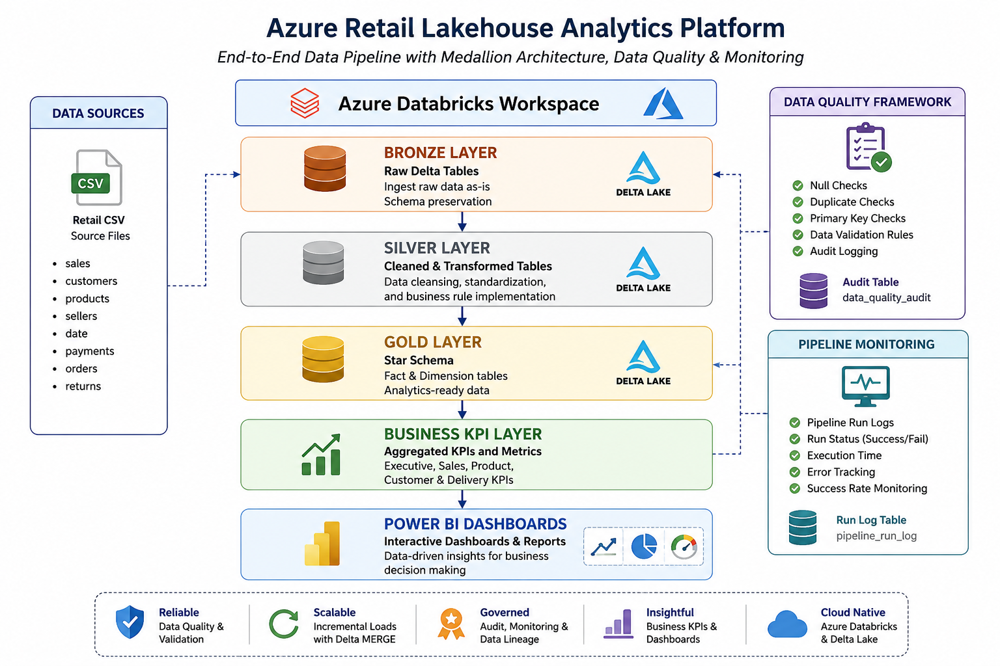

# Azure Retail Lakehouse Analytics Platform

Enterprise-scale Azure Databricks Lakehouse solution built using PySpark, Delta Lake, Medallion Architecture, Incremental ETL, Data Quality Framework, Pipeline Monitoring, and Power BI.

## Project Overview

This project demonstrates the design and implementation of an end-to-end modern data platform using Azure Databricks and Delta Lake.

The solution ingests raw retail sales data, applies Medallion Architecture transformations (Bronze, Silver, Gold), implements automated data quality validation, supports incremental loading through Delta MERGE operations, and delivers business insights through interactive Power BI dashboards.

## Technology Stack

* Azure Databricks
* PySpark
* Delta Lake
* SQL
* Power BI
* GitHub
* Medallion Architecture
* Star Schema Modelling

## Architecture



## Key Features

### Bronze Layer

* Raw data ingestion
* Schema preservation
* Delta Lake storage

### Silver Layer

* Data cleansing
* Business transformations
* Standardization

### Gold Layer

* Star Schema modelling
* Fact and Dimension tables
* Analytics-ready datasets

### Incremental Load Framework

* Delta MERGE operations
* Upsert processing
* Incremental refresh strategy

### Data Quality Framework

* Null checks
* Duplicate checks
* Primary key validation
* Audit logging

### Pipeline Monitoring

* Pipeline run tracking
* Success rate monitoring
* Execution logging

## Power BI Dashboard

### Executive Overview


### Sales & Product Performance


### Operations & Delivery Analytics


### Data Engineering Monitoring


## Business KPIs

* Total Revenue
* Total Orders
* Total Customers
* Average Order Value
* Average Delivery Days
* Late Delivery Percentage
* Product Performance
* Seller Performance
* Pipeline Success Rate
* Data Quality Metrics

## Repository Structure

```text
azure-retail-lakehouse-platform
│
├── architecture/
├── dashboard/
├── docs/
├── images/
├── notebooks/
├── sql/
└── README.md
```

## Author

Jyotsna Pyarasani

Aspiring Data Engineer | Analytics Engineer

Specializing in Azure Databricks, PySpark, Delta Lake, SQL, Power BI and Modern Data Platforms.

